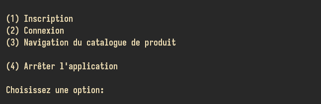
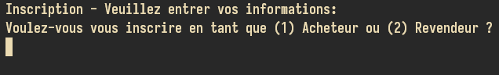
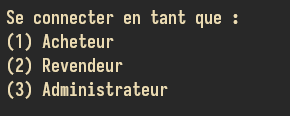
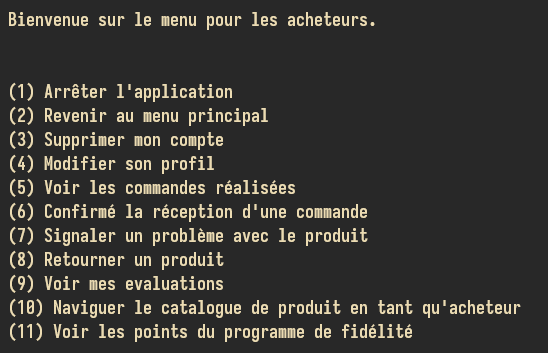
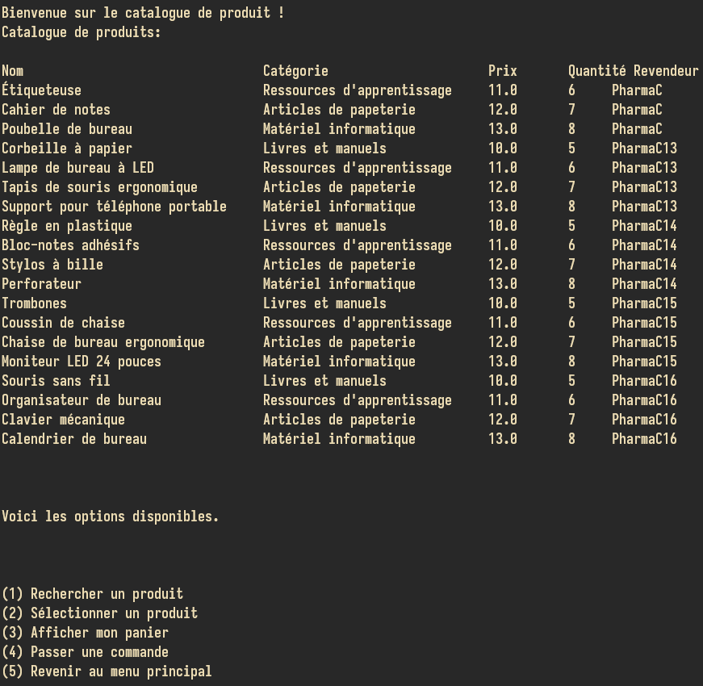

# Unishop : la plateforme pour préparer la rentrée des étudiants

Vous trouverez ici les instructions pour l'utilisation de l'application Unishop par les créateurs Unibuy.

Unishop est une plateforme de commerce sur laquelle il est possible de commander des articles   
de bureau, afin de bien entamer la rentrée scolaire. Les utilisateurs d'Unishop peuvent consulter un 
catalogue de produits qui sont offerts par des revendeurs vérifiés. Les utilisateurs peuvent également 
s'inscrire à Unishop pour avoir accès à des fonctionnalités réservées aux membres, dont la possibilité 
de commander des articles, consulter et effectuer des évaluations pour ces articles, et consulter 
et noter les évaluations des autres membres, entre autres. 

# Données de départ
La plateforme contient initialement 15 utilisateurs, dont 10 acheteurs et 5 revendeurs. 
- Chaque revendeur (Revendeur) possède, par défaut, 4 produits (TypeDeProduit) qu'il met en vente 
- Chaque acheteur (Acheteur) possède une commande (Commande) en cours et plusieurs commandes sont dans des états différents
- Les Commande sont effectuée après de différents Revendeur
- Au lancement du programme, un **fichier csv**, *Utilisateur.csv* répertorie l'ensemble des Utilisateur de 
type Revendeur ou Acheteur. 
- Un **fichier csv**, *typeDeProduit.csv* répertorie l'ensembles des produits (associés à leurs revendeurs respectifs).- Au lancement de l'application, un **fichier csv**, *evaluations.csv*, contient par défaut **3 évaluations** par 
l'utilisateur *Essai Pololo*.

### Bases de données temporaires
Nous utilisons des structure de données java (surtout ArrayList) pour répertorier les objets importants. 
Les utilisateurs, produits, évaluations, commandes, etc, sont présents dans les baseDeDonnes de la classe 
Controleur.java. Cette approche permet de manipuler rapidement les objets puisqu'ils sont dans la *mémoire à court terme* du système. Lorsqu'un ajout ou une déletion est faite, les structures de données conernées sont modifiées 
par les méthodes appropriées.

### Bases de données à long terme 
Nous utilisons également des fichiers csv pour conserver les données de façon permanente. Lorsqu'un ou une déletion est effectuée, le fichier csv concerné est également modifié (parallèlement à la modification de la structure de données java concernée). Lorsque le programme est arrêté puis redémarrré, certaines méthode ont pour rôle de remplir les 
structures de données java; elle initialisent l'application à son état précédent de sorte à ce que toute modification qui a été effectuée dans une séance précédante est conservée dans une séance présente ou future. 

# Lancer le programme 
Pour lancer le programme, il suffit d'utiliser le fichier jar que nous avons construit. Il est nécessaire d'utiliser 
java 21, puisque le jar a été compilé selon cette version. Après avoir télécharger le jar, l'utilisateur peut lancer l'application depuis un terminal en utilisant la commnade **java -jar nomDuJar.jar**.  

# Démarrage de l'application
Lorsque le logiciel est lancé, les bases de données d'utilisateurs (acheteurs et revendeurs), sont initialisées; 
des profils par défaut sont crées lorsque le programme est utilisé pour la première fois. 
- La base de données d'utilisateurs contient *5 profils revendeurs par défaut*. 
- La base de données d'utilisateurs content *10 profils d'acheteurs par défaut*.
- La base de données de produit contient *19 produits différents*. 
- Intialement, il n'y a aucune commande dans la base de données  repertoriant les commandes. 

# Menu Principal 

Le menu principal offre plusieurs options.
- Il est possible de naviguer le catalogue de produit pour les utilisateurs qui ne sont pas inscrit. Les fonctionnalités sont cependant **limitées**. 
- L'uilisasteur désirant s'inscrire sera **redirigé** vers un nouveau menu pour l'inscription.  

## Inscription à la plateforme Unishop 
- Deux **options d'inscriptions** sont offertes, soit l'inscription en tant **qu'acheteur** ou l'inscription 
en tant que **revendeur**. 
- Dépendamment du **types d'inscription sélectionné**, différentes informations sont demandées à l'utilisateur.

## Connexion à la plateforme Unishop
Lorsque l'utilisateur choisit de se connecter, il lui est offert la possibilité de se connecter en tant qu'acheteur 
ou revendeur. Chaque compte possède des identifiants unitques. Les mécanisme de connexions vérifie si les identifiants 
entrés dans les champs fournies appartiennent à un *revendeur* ou *acheteur* dans la base de données 
d'utilisateurs.

# Menu Acheteur 

- À n'importe quel moment, l'acheteur peut arrêter l'application ou revenir au menu principal.  
- Plusieurs options sont offertes pour que l'acheteur puisse modifier son compte. 
- Si l'acheteur a déjà effectué des commandes, il lui est possible de les consulter. 
- Pour **passer une commande** il faut d'abord *naviguer le catalogue de produit*, sélectionner un produit, et l'ajouter à son panier. 
- L'acheteur peut interagir avec ses commandes en confirmant la réception d'un produit, en signalant un 
problème avec un produit ou en demandant à retourner un produit. 
- Il est également possible d'afficher les **informations du compte de l'acheteur**, qu'il s'agisse des évaluations 
ou des points de fidelité. 

# Naviguation du catalogue de produit 

- L'acheteur peut filtrer les produit par l'option *rechercher un produit*. 
- Lorsque l'utilisateur *sélectionne un produit* il est redirigé vers un menu lui offrant diverse options :
    - Afficher les détails du produit 
    - Interagir avec le produit (aimer, évaluer, afficher les évaluations effectués)
    - Ajouter le produit au panier.
- L'utilisateur peut *passer une commande* si son panier contient un article; il peut également consulter son panier. 

# Passer une commande 
L'utilisateur peut passer une commande *lorsque son panier contient au moins un article*. Plusieurs informations 
lui sont demandées (numéro de téléphonbe, adresse de livraison), quatité voulue pour l'article. 
- L'acheteur peut entrer de nouvelles information ou utiliser les informations par défaut de son compte 
- Lorsque le panier contient des articles de différents revendeurs la commande est automatiquement 
divisées en plusieurs commandes; il y a alors une commande par revendeur. 

# Retourner un produit 
Cette fonctionnalité est accessible à partir du **menu acheteur**. Une série d'information est demandée 
à l'utilisateur pour compléter le retour de la commande

# Signaler un problème avec un produit 
Cette fonctionnalité est également accessible à partir du **menu acheteur**. Une série d'information est demandée 
à l'utilisateur pour comprendre la nature du problème afin que le revendeur soit avisé. 

